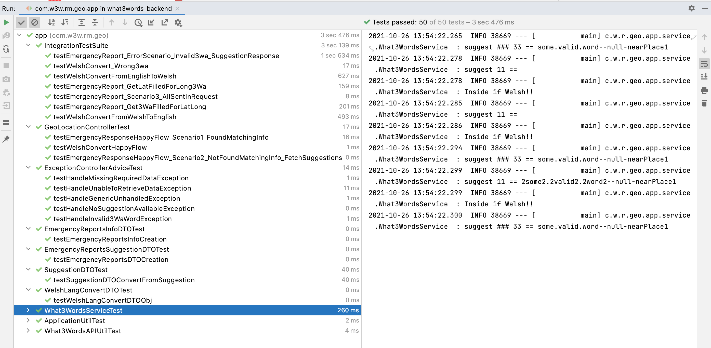
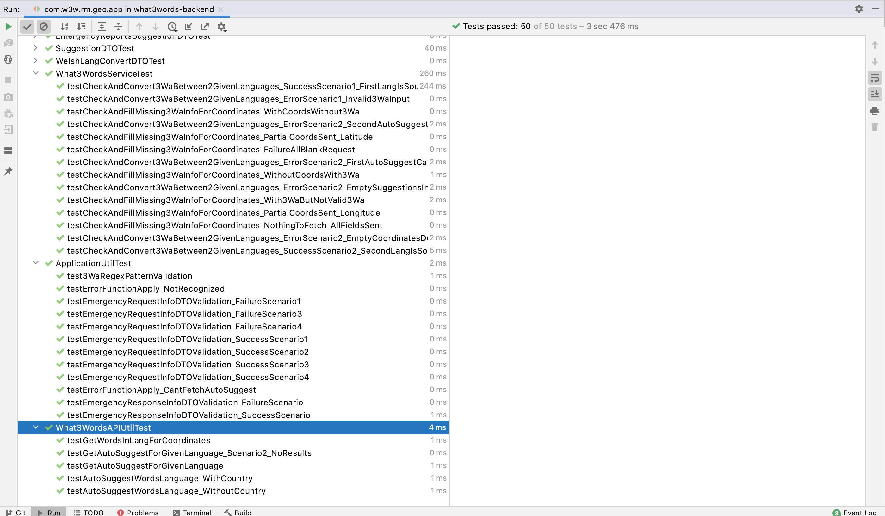
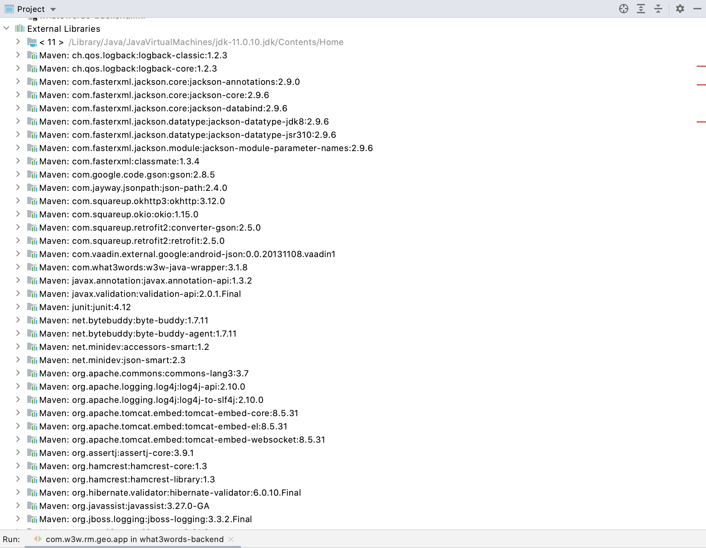
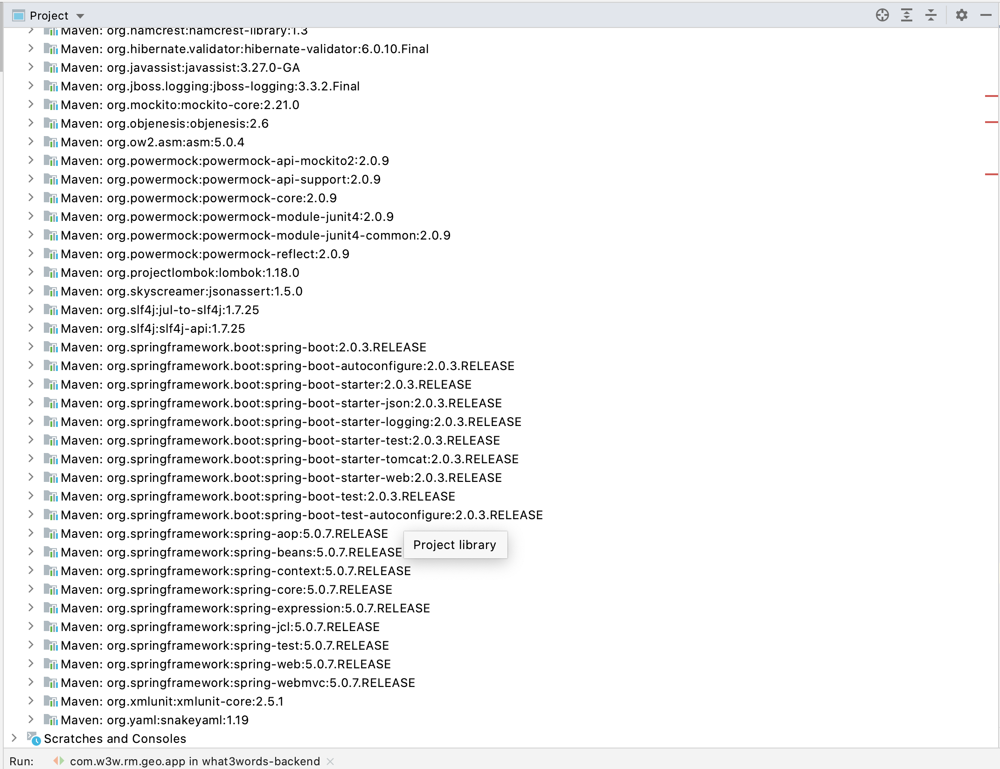

# Emergency Report REST API Powered by What3Words

This is a Java based REST application which intends performing emergency alerting using what3words API.
It is a minimal Proof of concept that adheres to the requirements mentioned in [Here](./Requirements.md)

### Key aspects related to implementation:
- Employing test driven development practice while building application - Each module goes through the `red` -> `fix` -> `green` -> `refactor` cycle
- Intensive unit tests - Mocktio based unit tests to observe interactions of various actors
- Separation of concerns - Modular approach on top of MVC paradigm in giving specific responsibility to each modules in the application
    - *Service layer* to handle data persistence and business logics required to invoke the what3words api with the location data supplied
    - *Controller* to handle all the endpoint calls to process the data from users.
    - *Models* to keep track of data that is processed by the system.
    - *ControllerAdvice* to handle all the user defined exceptions handled at the runtime to send proper response code to users to better understand the flow.
- Dependency resolution with Spring-Boot's Auto-configuration and dependency resolution.
- MVC test to support integration testing of the entire Spring Application.
- Lombok - used annotation based pre-processing to reduce a lot of boilerplate code that can be deferred to compile time.


## TDD - Red->Green->Refactor cycle


## REST APIs

#### Convert from English to Welsh
##### Request
```http
POST /emergency-api/welsh-convert HTTP/1.1
Host: localhost:8080
Content-Type: application/json

{
    "3wa": "daring.lion.race"
}
```
### Request format:
*3wa* – the input 3wa string to be converted to the other language.

##### Response
Returns: Empty converted 3wa in to the other language:

200 – in case of success

400 – if the 3wa is invalid

503 – if the API invocation to What3Words external service fails.


```http
HTTP/1.1 200 OK
Content-Type: application/json

{
    "3wa": "sychach.parciau.lwmpyn"
}

```

OR

```http
HTTP/1.1 400 Bad Request
Content-Type: application/json

Content-Type: application/json;charset=UTF-8
{
    "message": "3wa not recognised: filled.count.asd12"
}
```


#### Get Report filled with missing info
##### Request
```http
POST /emergency-api/reports HTTP/1.1
Host: localhost:8080

{
    "message":"A hiker has got lost",
    /* "lat": null,
    "lng":null, */
    "3wa": "daring.lion.race",
    "reportingOfficerName": "Joe Bloggs"
}

```

OR

```http
POST /emergency-api/reports HTTP/1.1
Host: localhost:8080

{
    "message":"A hiker has got lost",
    "lat": 51.508341,
    "lng":-0.125499,
    "3wa": null,
    "reportingOfficerName": "Joe Bloggs"
}

```


### Request format:
*message* – the input message related to the emergency reported.
*lat* – the input location latitude value.
*lng* – the input location longitude value.
*3wa* – the input 3wa string to be converted to the other language.
*reportingOfficerName* – the name of the reporting person from the location.


##### Response
Returns: The filled location report for request posted to the endpoint.
Or if the 3wa is not grammatically correct, then the suggestions closer to the given 3wa.

```http
/* HTTP/1.1 200 */
Content-Type: application/json;charset=UTF-8

{
    "message":"A hiker has got lost",
    "lat": 51.508341,
    "lng":-0.125499,
    "3wa": "daring.lion.race",
    "reportingOfficerName": "Joe Bloggs"
}
```
OR


```http
/* HTTP/1.1 200 */
Content-Type: application/json;charset=UTF-8
{
    "message":"3wa not recognised: filled.count.snap",
    "suggestions": [
        {
            "country": "GB",
            "nearestPlace": "Bayswater, London",
            "words": "filled.count.soap"
        },
        {
            "country": "GB",
            "nearestPlace": "Wednesfield, W. Midlands",
            "words": "filled.count.slap"
        },
        {
            "country": "GB",
            "nearestPlace": "Orsett, Thurrock",
            "words": "fills.count.slap"
        }
    ]
}
```
OR
```http
/* HTTP/1.1 422 UNPROCESSABLE ENTITY */
Content-Type: application/json;charset=UTF-8
{
    "message": "Invalid Request!"
}
```


```http
/* HTTP/1.1 402 INVALID REQUEST */
Content-Type: application/json;charset=UTF-8
{
    "message": "3wa not recognised: filled.count.asd12"
}
```


```http
/* HTTP/1.1 500 SERVICE ERROR */
Content-Type: application/json;charset=UTF-8
{
    "message": "3wa not recognised: filled.count.asd12"
}
```

##### Response
Returns the appropriate response for the location information passed.

200 – in case of success

400 – if the 3wa is invalid

503 – if the API invocation to What3Words external service fails.

### Test Coverage




### Dependencies



## Testing
This application is build following TDD principles and are rich with various integration/unit tests based on test pyramids
To run all the tests:

```bash
mvn clean test
```

## Build
In order to build this application, run the following maven command.
```bash
mvn clean package
```
### installing the packages
With Tests:
```bash
$ mvn clean install -U
```
### running tests
Unit tests:
```bash
$ mvn  test
```

>         Developed in Jetbrain's IntelliJ IDE

## References
 - what3words java wrapper : https://developer.what3words.com/tutorial/java
  - API details: https://developer.what3words.com/public-api/docs#overview
 - mocktio failing for API class: https://stackoverflow.com/a/58200905
 - json name setting: https://stackoverflow.com/q/40969156
 - `handlerExceptionResolver` not found bean issue : https://stackoverflow.com/a/56121977
 - json ignore fields: https://www.baeldung.com/jackson-ignore-null-fields
 - integration testing: https://stackoverflow.com/a/35402975
 - Mock external API call :
    - https://stackoverflow.com/questions/20504399/testing-springs-requestbody-using-spring-mockmvc
    - using wiremock : https://stackoverflow.com/a/40908543
    - using easymock: https://stackoverflow.com/a/61685017
- assert json content in mvc testing : https://stackoverflow.com/a/41670634


## License

MIT
